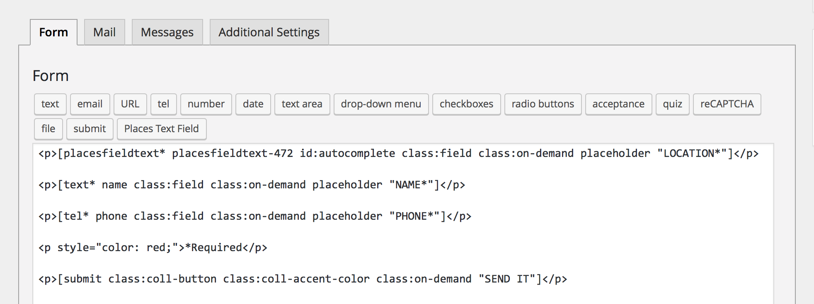
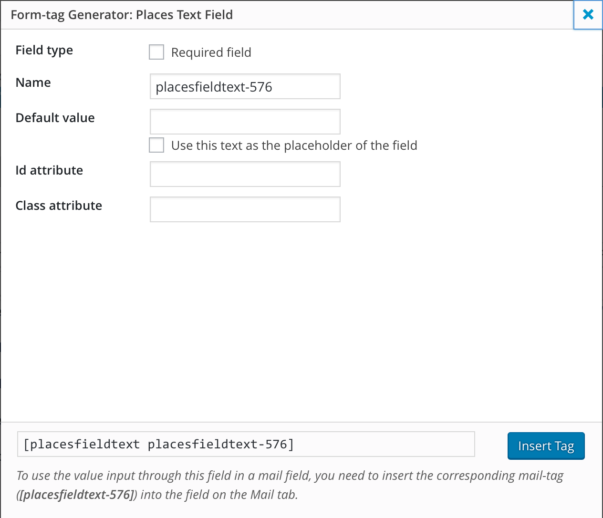
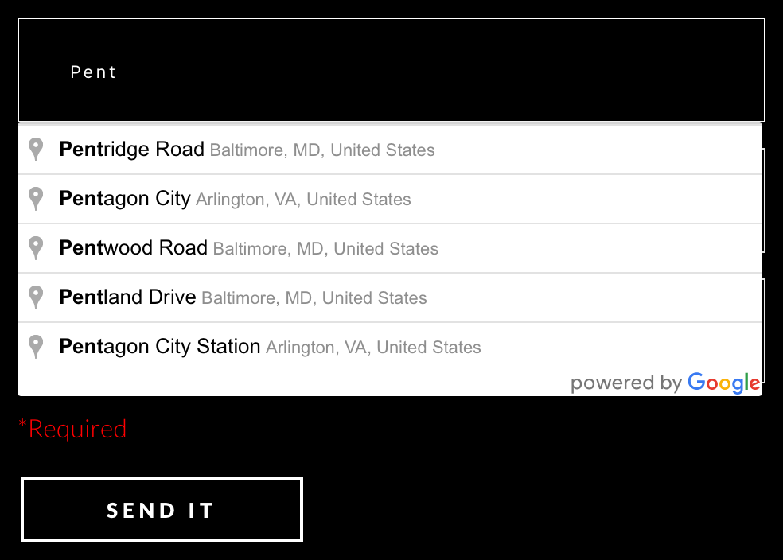

Contact Form 7 - Google Places API Plugin
=========================================

WordPress.org plugin solution to adding a places text field to Contact Form 7, that "just works".

## Description

This plugin adds a new tag type for the Contact Form 7 plugin. This new tag type labeled "Places Text Field" will be present in the Contact Form 7 editor. Using it in your form will add a text input field, that triggers the Google Places API once the user has made a character entry into the field. As the user types, they will see a dropdown list of returned place predictions for them to select.

### Requirements:
  * Contact Form 7 plugin.
  * API key from Google.
  * A sense of humor.

## Installation

You will need to install this manually:

1. Unzip the archive and put the 'contact-form-7-google-places-api' folder into your plugins folder (/wp-content/plugins/).
2. Open the 'contact-form-7-google-places-api.php' file in a code editor and follow the instructions to place your API key from Google on line 40.
2. Activate the plugin from the Plugins menu.
3. Go to Contact->Add New and you can now create a form with the 'Places Text Field' tag type.

## Frequently Asked Questions

#### Will this work with any contact form plugin?
No, this plugin is specifically for Contact Form 7, which is also free.
#### Do I really need to create my own Google API key?
Yes, as of 2016 Google has made it a requirement, that any application using any of their Google Maps APIs must now have an API key. So, in order for the Google Places API plugin to work you will need to create your own API key.
#### Do I really need a sense of humor?
No, not really, but it couldn't hurt.

## Resource Links

1. [Get Google API Key](https://developers.google.com/maps/documentation/javascript/get-api-key)
2. [Google Places API](https://developers.google.com/places/web-service/)
3. [Contact Form 7](https://wordpress.org/plugins/contact-form-7/)

## Screenshots

1. What it looks like after selecting the 'Places Text Field' button in the editor.

2. What it looks like after entering the 'Places Text Field' into your form.

3. What the 'Places Text Field' looks like in action.

## Changelog

#### 1.0
* Start version.
